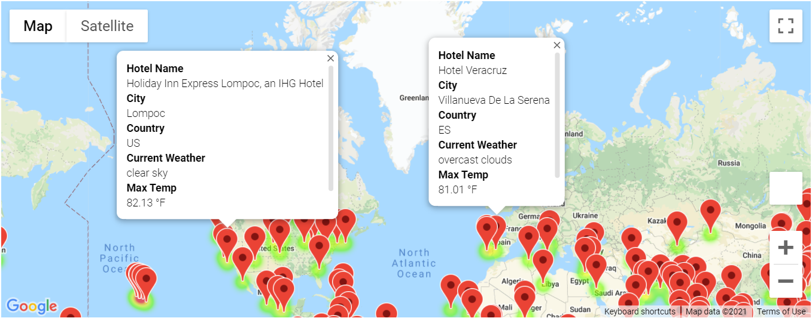

# ***World Weather Analysis***

## **Overview of Analysis:**

The purpose of this analysis was to use the google maps API and the OpenWeather API to plan a vacation for customers, depending on their user input variable of weather. We also plotted an itinerary for customers based on their specific weather preferences and printed directions for their travel. 

## **Results:**

Please observe the following: 

In this image, we used the google maps heat map to find all the cities within a specific weather parameter and within a random assortment of 1,500 latitudes and longitudes. We then added markers indicating the hotels, city name, country, current weather, and max temperature for those cities. 

We were also able to map out directions to four cities for our customer based on those parameters and recommend nearby hotels, as shown in the following images: 

## **Summary**

With this code, the PlanMyTrip app is ready for users to input and use based on their weather preferences. 